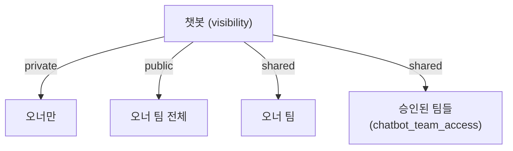
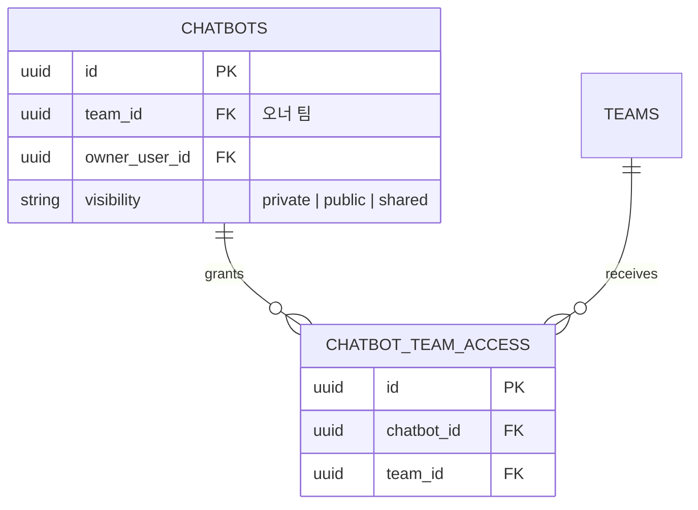

# 챗봇 교차팀 공유 (Cross-Team Sharing)

> **✅ 실제 구현 (2026-06 기준) — 아래 §1~ 본문은 폐기된 초기 설계안이라 일부 어긋납니다. 진실은 이 박스.**
>
> **가시성 3값**: `private`(소유자만) / `public`(소유자 **팀 전체**, 교차팀 아님) / `shared`(소유자 팀 + 추가 승인 팀). enum 에 `shared` **추가됨**(`schema_upgrade` 가 `ALTER TYPE chatbotvisibility ADD VALUE 'shared'`).
> - **추가 팀 지정**: 전용 `/shares` 엔드포인트 **없음**. `POST`·`PATCH /chatbots` 의 인라인 필드 **`extra_team_ids`** 로 처리(`visibility != shared` 면 백엔드가 자동 청소). 팀 목록은 `GET /team/list`(TeamLite, invite_code 비노출).
> - **저장**: `chatbot_team_access`(chatbot_id, team_id, created_at — `granted_by` 컬럼 없음).
> - **접근 판정**: `chatbot_service._user_can_access` — 소유자/같은 팀(비-private)/타 팀은 shared 이고 `chatbot_team_access` 에 등록된 경우.
> - **교차팀 데이터 격리(중요)**: 타 팀 사용자가 shared 챗봇을 쓸 때 RAG 는 **챗봇에 연결된 문서만** 검색한다(`resolve_rag_scope_doc_ids` 가 요청자 팀≠소유 팀이면 스코프 무시하고 linked-only). 소유팀의 team_all/owner_visible 문서는 **노출되지 않음**.
> - UI: 생성/편집 페이지 모두 팀 multi-select + "전체 팀(조직 전체)" 선택 토글.

## 1. 왜 필요한가

- 인사팀 "인사 규정 봇"을 영업팀도 그대로 쓰고 싶다.
- 다만 **원본 문서에는 접근 권한을 주지 않는다** — 챗봇을 통한 질의응답만 허용.
- 전사 공개(아무 팀이나 사용)를 기본값으로 두지 않는다 — 꼭 사용해야 할 팀만 오너가 **승인**해 공유한다.

## 2. 가시성 규칙 (단순화)

| visibility | 사용 가능한 사용자 |
| ---------- | ----------------- |
| `private` | 오너(`owner_user_id`)만 |
| `public` | **오너 팀 전체**(교차팀 아님) |
| `shared` | **오너 팀 + `chatbot_team_access` 에 등록된 추가 팀**의 구성원 |

교차팀 공유는 `shared` 가 담당하며 `public` 은 오너 팀 한정입니다(상단 진실 박스 참조).



- 오너 팀은 **항상** 접근 가능(묵시). 별도 레코드 필요 없음.
- 승인 리스트가 비어 있으면 `public`은 **기존 동작과 동일**(오너 팀만 사용 가능).
- 타 팀 추가/제거는 오너 또는 오너 팀의 `team_admin` 이상만 수행 가능.

호환성: 기존 `public` 값은 그대로 유지. enum 확장 불필요.

## 3. 데이터 모델

### 3.1 신규 테이블 — `chatbot_team_access`

```
chatbot_team_access
┌────────────┬──────────────────────────────────────────┐
│ id │ UUID PK │
│ chatbot_id │ UUID FK chatbots.id ON DELETE CASCADE │
│ team_id │ UUID FK teams.id ON DELETE CASCADE │
│ created_at │ TIMESTAMP │
│ UNIQUE (chatbot_id, team_id) │
└────────────┴──────────────────────────────────────────┘
```

- `visibility=shared` 일 때만 의미 있음. 그 외 가시성이면 백엔드가 레코드를 자동 청소(`replace_extra_team_access(…, [])`).
- 실제 컬럼은 `id`(PK)·`chatbot_id`(FK CASCADE)·`team_id`(FK CASCADE)·`created_at` 와 `UNIQUE(chatbot_id, team_id)` 뿐이다(`granted_by` 미구현).
- `chatbot` 삭제 시 cascade. 팀 삭제 시에도 cascade 후 공유 자동 해제.

### 3.2 ERD 조각



## 4. 권한 매트릭스

| 작업 | 오너 | 오너 팀의 team_admin | 승인된 타 팀 팀원 | 미승인 타 팀 | super_admin |
| ---- | :---: | :---: | :---: | :---: | :---: |
| 대화 시작 (`public`) | | | | ❌ | |
| 대화 시작 (`private`) | | ❌ | ❌ | ❌ | |
| 프롬프트/문서/도구 편집 | | | ❌ | ❌ | |
| `public`↔`private` 전환 | | | ❌ | ❌ | |
| 승인 팀 추가/제거 | | | ❌ | ❌ | |
| 소유 문서 **직접 다운로드** | | | ❌ | ❌ | |

핵심 — **챗봇 응답은 허용, 원본 문서 접근은 허용하지 않음.**

## 5. 권한 체크 로직

`services/chatbot_service.py::_user_can_access()` (래퍼 `get_for_use()` 에서 호출):

```python
if chatbot.owner_user_id == user.id:
 return True                                  # 소유자는 항상
if chatbot.team_id == user.team_id:
 # 같은 팀: private 면 소유자만, 그 외(public/shared)는 팀원도 OK
 return chatbot.visibility != ChatbotVisibility.private
# 다른 팀: shared 인 경우 chatbot_team_access 에 내 팀이 등록되어 있어야 함
if chatbot.visibility != ChatbotVisibility.shared:
 return False                                 # public 은 타 팀에 절대 열리지 않음
return await _team_is_granted(db, chatbot.id, user.team_id)
```

내 접근 가능 챗봇 목록(`GET /chatbots` → `chatbot_service.list_visible`):

```sql
WITH me AS (SELECT :user_id::uuid AS uid, :team_id::uuid AS tid)
SELECT c.*
 FROM chatbots c, me
 WHERE c.owner_user_id = me.uid
 OR (c.visibility != 'private' AND c.team_id = me.tid)
 OR (c.visibility = 'shared'
 AND EXISTS (
 SELECT 1 FROM chatbot_team_access a
 WHERE a.chatbot_id = c.id AND a.team_id = me.tid
 ))
 ORDER BY c.updated_at DESC;
```

## 6. RAG 스코프와의 상호작용

`rag_scope=linked_only` — 오너가 명시적으로 연결한 문서만. **교차팀 공유의 권장 기본값**(오너 팀 문서가 다른 팀에 새 나가지 않도록 명확히 통제).

`owner_visible`/`team_all` — 공유된 챗봇에서 사용 시 UI에서 **경고** 표시(오너가 볼 수 있는 문서 전체가 타 팀의 질의 결과에 인용될 수 있음). 명시적으로 덮어써야 저장 허용.

## 7. API

| 메서드 | 경로 | 설명 |
| ------ | ---- | ---- |
| `GET` | `/chatbots` | 내가 접근 가능한 목록(오너 + 오너 팀 public/shared + 승인 받은 shared) |
| `POST` / `PATCH` | `/chatbots` · `/chatbots/{id}` | 본문 인라인 필드 `extra_team_ids: [team_uuid...]` 로 공유 팀 지정·교체(`visibility != shared` 면 백엔드가 자동 비움). 전용 `/shares` 엔드포인트는 **없음** |
| `GET` | `/team/list` | 공유 팀 선택용 팀 목록(`TeamLite`, `invite_code` 비노출) |

요청 예:

```http
PATCH /chatbots/{id}
{ "visibility": "shared", "extra_team_ids": ["<team-uuid-1>", "<team-uuid-2>"] }
```

`visibility` 가 `shared` 가 아니면 `extra_team_ids` 를 보내더라도 백엔드가 무시·청소합니다(전용 권한 오류 대신 정책적 자동 정리).

## 8. UI 변경

- `/chatbots/[id]` 편집 "기본" 섹션(탭 아님 — 단일 스크롤 폼):
 - 가시성은 **3값 라디오 카드** `VisibilityChooser`(`🔒 나만` / `👥 우리 팀` / `🌐 선택 팀`) — 표시 명칭·아이콘은 `features/chatbots/labels.ts` 단일 소스.
 - `선택 팀`(=`shared`) 선택 시 하단에 회사→팀 트리+검색 `TeamPicker`(`features/chatbots/TeamPicker.tsx`)가 펼쳐진다. 고른 팀은 별도 호출이 아니라 **저장(`PATCH /chatbots/{id}`) 본문의 `extra_team_ids`** 로 전달된다. **전용 `/shares` 엔드포인트는 없다.**
- 생성(`/chatbots`)·편집(`/chatbots/[id]`) 페이지가 `VisibilityChooser`·`TeamPicker` 를 공유한다.
- `/chatbots` 목록 뱃지: 가시성 태그는 `labels.ts` 의 `visibilityTag()`(`🔒 나만` / `👥 우리 팀` / `🌐 선택 팀`)로 통일.

## 9. 감사 · 책임 추적

- `chatbot_team_access` 에는 `granted_by` 컬럼이 없어 "누가 승인했는지"는 별도로 기록되지 않는다(향후 컬럼 추가 시 추적 가능).
- `Conversation.chatbot_id`로 "A팀 챗봇을 B팀원이 사용"한 대화를 사후 조회 가능.
- `/team/audit/conversations` 는 본인 팀 소속 사용자의 대화만 반환 → 오너 팀이 타 팀 대화를 들여다볼 수 없음(개인정보 경계). 필요 시 별도 "공유 챗봇 열람" 권한 플래그를 추가.

## 10. 마이그레이션 단계

1. `chatbot_team_access` 테이블 신설(cascade FK 포함).
2. 서비스 계층(`chatbot_service`, `chatbot_rag`)에 팀 접근 체크 로직 주입.
3. 기존 `public` 챗봇은 변경 없이 **오너 팀 전용**으로 계속 동작.
4. 프론트 공유 UI 는 별도 `/chatbots/[id]/shares` 화면/엔드포인트가 **아니라**, 편집·생성 폼의 `VisibilityChooser`+`TeamPicker` 로 처리하고 저장 시 `extra_team_ids` 로 전달한다(§8 및 상단 진실 박스 참조 — 전용 `/shares` 엔드포인트 없음).
5. (선택) 감사 화면에 "공유 챗봇 대화" 필터 제공.

## 11. 오픈 이슈

- **LLM 비용 귀속** — A팀 챗봇을 B팀이 쓰면 비용은 누구 부담? → `conversations.owner_team_id` 컬럼으로 집계 기준 분리 검토.
- **Rate-limit** — 챗봇/팀/사용자 중 어디서 제한할지 결정.
- **지식 차단(mute)** — 공유 받은 팀이 특정 문서를 답변에서 배제하고 싶은 경우 `chatbot_documents.muted_team_ids` 등 후속 확장.
- **승인 취소 시** — 진행 중인 대화에 어떻게 반영할지(즉시 차단 vs. 새 메시지부터 차단) 정책 결정.
