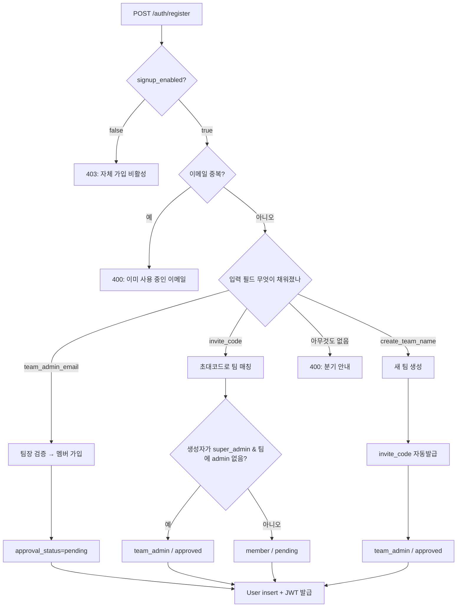

# auth — 로그인/가입/승인/세션

`backend/app/features/auth/router.py` (661줄). 사용자 등록·로그인·SSO·회전 refresh·로그아웃·내
정보/메모리·내 팀·BYOK API 키까지 한 파일에 모여 있습니다. 가입 흐름은 3가지 분기(팀장 이메일 /
초대 코드 / 신규 팀 생성)가 섞여 있어 한 번 읽고 가야 헷갈리지 않습니다.

## 1. 외부 API

`@router` 데코레이터 기준 전체 엔드포인트:

| 메서드 | 경로 | 설명 |
|---|---|---|
| GET | `/auth/config` | 비인증 공개 설정 `{signup_enabled, sso_enabled}` — 로그인/가입 화면 게이트 |
| POST | `/auth/register` | 가입 — 세 분기에 따라 즉시 승인 or 대기 (운영은 signup 차단 → 403) |
| POST | `/auth/login` | 로그인 — access JWT + 회전 refresh 반환 |
| POST | `/auth/sso/exchange` | 포털 SSO 토큰(HS256) → 세션 교환 + JIT 가입 |
| POST | `/auth/refresh` | 회전 refresh — 새 access+refresh 쌍 발급 |
| POST | `/auth/logout` | 본문의 refresh 토큰을 DB 에서 철회(revoke) |
| GET | `/auth/me` | 토큰 → 본인 정보(팀명 포함) |
| GET | `/auth/me/memory` | AI 개인화 메모리 열람 |
| DELETE | `/auth/me/memory` | 개인화 메모리 전체 삭제 (204) |
| GET | `/auth/team` | 본인이 속한 팀 |
| GET | `/auth/me/api-keys` | BYOK — 등록된 내 LLM 키 목록(fingerprint 만) |
| POST | `/auth/me/api-keys` | BYOK — 키 등록(anthropic/openai/google) |
| DELETE | `/auth/me/api-keys/{key_id}` | BYOK — 키 해제 (204) |

요청/응답 스키마는 `app/schemas.py` — `UserCreate`, `UserLogin`, `TokenResponse`,
`RefreshRequest`, `LogoutRequest`, `UserOut`, `TeamOut`, `RegisterApiKeyIn`, `UserApiKeyOut`.

## 2. 가입 (`register`, router.py:88-227)

첫 단계는 **자체 가입 게이트**입니다 (router.py:94-100):

```python
if not get_settings().signup_enabled:
    # SSO 전환(2026-07-07) — 계정은 포털 JIT 로 생성되므로 자체 가입은 차단
    raise HTTPException(status_code=403, detail="자체 회원가입이 비활성화되어 있어요. ...")
```

운영에서는 `signup_enabled=false` 라 `/auth/register` 는 403 이고, 계정은 SSO JIT(3-2)나 HR
동기화로 생깁니다. 아래 3분기는 signup 이 켜진(개발/부트스트랩) 환경에서만 유효합니다.



### 2-1. 팀장 이메일 분기 (`router.py:111-139`)

가장 흔한 케이스 — 이미 만들어진 팀에 합류:

```python
admin_res = await db.execute(
    select(User).where(
        User.email == admin_email,
        User.role.in_([UserRole.team_admin, UserRole.super_admin]),
        User.approval_status == ApprovalStatus.approved,
        User.is_active.is_(True),
    )
)
team_admin = admin_res.scalar_one_or_none()
```

`team_admin` 도 `super_admin` 도 팀장으로 인정합니다. 두 명 이상 일치하는 일은 이론적으로 없음(email unique), 그러나 `scalar_one_or_none` 으로 방어.

가입은 **항상 pending** — 팀장이 `/admin` 콘솔에서 승인하기 전에는 로그인 불가.

### 2-2. 초대 코드 분기 (`router.py:140-162`)

팀의 `invite_code` 컬럼(`secrets.token_urlsafe(12)`) 으로 매칭. 의도된 부트스트랩 경로 — super_admin 이 만든 팀에 첫 team_admin 이 들어올 때:

```python
if invited_by and invited_by.role == UserRole.super_admin:
    has_admin = (await db.execute(...team admin exists check...)).scalars().first()
    if has_admin is None:
        role = UserRole.team_admin
        approval = ApprovalStatus.approved
```

즉 **팀에 admin 이 아직 없을 때만** 첫 가입자가 자동으로 team_admin 이 됩니다. 두 번째 사람부터는 일반 member + pending.

### 2-3. 새 팀 생성 분기 (`router.py:163-181`)

super_admin 이 자기 팀을 만드는 시나리오. 슬러그 충돌 회피로 50번까지 `-1`, `-2` 시도:

```python
for n in range(0, 50):
    cand = slug if n == 0 else f"{base}-{n}"
    taken = await db.execute(select(Team).where(Team.slug == cand))
    if not taken.scalar_one_or_none():
        slug = cand
        break
```

그리고 새 팀 + 신규 invite_code 발급. 생성자는 자동으로 `team_admin` + `approved`.

## 3. 로그인 (`login`, router.py:264-311)

### 3-1. 관대한 본문 파싱 + 위임 로그인

```python
payload = await _lenient_login_body(request)   # Content-Type 무관 파싱 (router.py:230-261)
ident = payload.email.strip().lower()
if "@" in ident:
    res = await db.execute(select(User).where(User.email == ident))
else:                                            # 그룹웨어 아이디(login_id)
    res = await db.execute(select(User).where(func.lower(User.login_id) == ident))
user = res.scalar_one_or_none()

def _delegated_ok(u: User) -> bool:
    # 그룹웨어 USER_PASS = 무염 SHA-256 4회 hex (공식은 core/security.py 에 중앙화)
    if not u.external_pass_sha256:
        return False
    digest = groupware_password_hash(payload.password)   # security.py:32-36
    return hmac.compare_digest(digest.lower(), u.external_pass_sha256.lower())

ok = bool(user) and (
    verify_password(payload.password, user.hashed_password) or _delegated_ok(user)
)
if not ok:
    raise HTTPException(status_code=401, detail="아이디(이메일) 또는 비밀번호가 올바르지 않습니다.")
```

세 가지가 기존 워크스루와 다릅니다:

- **`_lenient_login_body`** — 사내 포털이 `application/json` 을 못 보내고 form-urlencoded·
  text/plain·헤더 없음으로 `{email,password}` 를 보내는 경우가 있어, 원문 바이트를 받아
  JSON→폼 순으로 관대하게 해석합니다(JSON 클라이언트는 그대로 동작).
- **식별자 분기** — `@` 가 있으면 이메일, 없으면 그룹웨어 아이디(`User.login_id`, 소문자 비교).
- **그룹웨어 위임** — 자체 bcrypt(`verify_password`)가 실패해도, HR 동기화가 저장한
  `external_pass_sha256` 를 **무염 SHA-256 4회 반복**(`GROUPWARE_SHA_ROUNDS=4`) 공식으로 대조해
  통과하면 로그인 성공. `hmac.compare_digest` 로 타이밍 안전 비교.

그 다음 계정 상태 가드:

```python
if not user.is_active:          # 403 비활성화된 계정입니다.
if user.approval_status == ApprovalStatus.rejected:   # 403 반려
if user.approval_status == ApprovalStatus.pending:    # 403 승인 대기
```

**401 / 403 구분** 을 유의 — 401 은 "아이디(이메일)/비밀번호 잘못", 403 은 "본인 맞지만 계정 상태가 문제". 프론트는 두 상태를 다르게 안내합니다.

### 3-2. 세션 발급 — access JWT + 회전 refresh

성공 시 짧은 access JWT(`_access_token_for`, 60분)와 함께 **회전 refresh 토큰**을 발급합니다:

```python
token = _access_token_for(user)                        # role/team_id/approval 클레임 포함
refresh_raw, _ = await _issue_refresh_token(db, user.id)   # opaque 랜덤, DB 엔 sha256 만
await db.commit()
return TokenResponse(access_token=token, refresh_token=refresh_raw,
                     approval_status=ApprovalStatusOut(user.approval_status.value))
```

`role`/`team_id` 가 access 토큰 안에 들어 있어 매 요청 DB 조회 없이 RBAC 가드를 1차로 거를 수 있습니다(2차는 `get_current_user` 가 DB 로 검증). refresh 토큰은 JWT 가 아닌 opaque 랜덤 문자열이며, DB(`refresh_tokens`)에는 sha256 해시만 저장합니다(`core/security.py:57-64`).

## 3-3. SSO 핸드오프 (`sso_exchange`, router.py:332-428)

포털 → 챗봇 무암호 진입. 포털이 `SSO_SHARED_SECRET`(HS256)으로 서명한 단기 JWT
(`sub`=email, `name`, `team?`, `jti`, `iat`, `exp`)를 프론트가 이 엔드포인트로 교환합니다.

- 검증: 서명·`exp`·`iat` 상한(`sso_token_max_age_seconds`)·`jti` 재사용 차단(프로세스 메모리 캐시).
- JIT 프로비저닝: 이메일 upsert — 최초 진입 시 계정 자동 생성(`approved`), 팀은
  `claims.team` → find-or-create(없으면 `sso_default_team_name`/bootstrap 팀). 비밀번호는
  로그인 불가능한 랜덤 해시.
- 응답은 로그인과 동일하게 access JWT + 회전 refresh.

## 3-4. 회전 refresh (`refresh`, router.py:431-493)

`RefreshRequest.refresh_token`(JSON 본문)을 받아 검증 후 **회전**합니다 — 기존 토큰을 철회하고
새 access+refresh 쌍을 반환:

- 존재하지 않는 토큰 → 401.
- **이미 철회된 토큰 재제시 = 재사용 공격 신호** → 해당 사용자의 모든 refresh 토큰을 일괄
  철회하고 401(`[REFRESH_REUSE]` 로그).
- 만료 토큰은 마주칠 때 삭제(lazy 정리, 별도 스윕 잡 없음).
- 계정이 비활성/미승인으로 바뀌었으면 토큰 철회 후 401.
- 정상 회전: 새 쌍 발급 → 기존 행 `revoked_at` + `replaced_by` 기록(같은 트랜잭션).

## 4. 로그아웃 (`logout`, router.py:496-517)

```python
@router.post("/logout", status_code=204)
async def logout(db, payload: LogoutRequest | None = None) -> None:
    if payload and payload.refresh_token:
        row = ... where token_hash == hash_refresh_token(payload.refresh_token)
        if row and row.revoked_at is None:
            row.revoked_at = datetime.now(timezone.utc)
            await db.commit()
    return None
```

**무동작이 아닙니다** — 본문의 refresh 토큰을 DB 에서 철회(revoke)해 이후 그 토큰으로는 access
재발급이 불가능합니다. body 가 없거나(옛 클라이언트) 토큰이 이미 철회/삭제된 경우에도 204
(멱등 + 토큰 존재 여부 비노출). access JWT 자체는 무상태라 만료까지 유효하므로 프론트가 로컬에서
삭제합니다.

## 5. 함정·결정

- **pending 사용자도 토큰을 받지만 빈 access_token** (`router.py:204-214`) — 프론트가 이걸 보고 "승인 대기" 화면을 띄움. 실수로 빈 토큰을 localStorage 에 넣으면 `getToken()` 이 truthy 처리할 수 있으니, 프론트는 빈 문자열도 falsy 로 다룸.
- **그룹웨어 해시 공식은 한 곳에** — 위임 로그인 검증과 관리자 비밀번호 재설정이 모두
  `core/security.py:groupware_password_hash`(무염 SHA-256 4회) 하나만 씁니다. 공식이 바뀌면
  여기만 고치면 됩니다.
- **`_slugify`** 가 한글을 살림 (`re.sub(r"[^\w\s-]", "")` + `flags=re.UNICODE`) — `\w` 가 unicode 단어 클래스라 한글은 살아남습니다. 영문화 안 함이 의도.
- **SSO jti 재사용 캐시는 프로세스 메모리** — 단일 레플리카 전제. 레플리카 확장 시 Redis 등 공유 저장으로 이전 필요(수명 ≤5분이라 위험 창은 짧다).

## 관련

- 토큰 생성/검증·회전 refresh·그룹웨어 해시 — `core/security.py`
- `get_current_user` — `core/deps.py` (RBAC 가드의 출발점)
- 부트스트랩 admin 자동 생성 — `services/bootstrap_admin.py` (lifespan 에서 호출)
- 사용자 관리 (승인·역할 변경·비밀번호 초기화) — [backend-misc](backend-misc.md)
